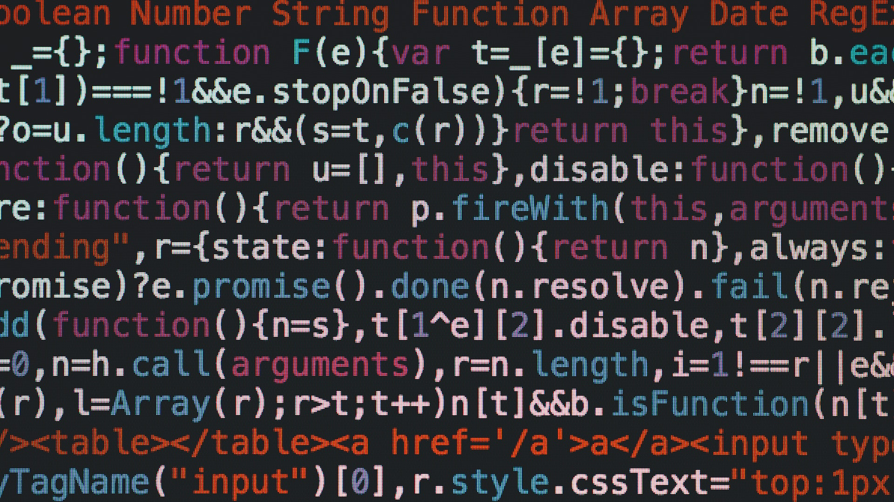

---

layout: yandex2

style: |
    /* собственные стили можно писать здесь!! */
    .slide em {
        font-style: italic;
    }

    .clearfix::after {
        content: ""; /* Генерируем пустой элемент */
        clear: both; /* Отменяем обтекание*/
        display: block; /* Блочный элемент */
    }


    .title h3 img {
        display: none;
    }

    .title h2 {
        width: 800px;
    }

    .title {
        background-image: url(/shri-js/pictures/young-and-yandex.jpg);
        background-size: contain;
    }

---

# {:.logo}

## {{ site.presentation.title }}
{:.title}

### {{ site.presentation.service }}



{:.nda}


<div class="authors">

<p>{{ site.author.name }}, {{ site.author.position }}</p>



<p>{{ site.author2.name }}, {{ site.author2.position }}</p>


</div>

## JavaScript vs ECMAScript

- ...<b>Ecma International</b> — организация, которая создает стандарты
- ...<b>ECMA-262</b> — стандарт, где описан скриптовый язык
- ...<b>ECMAScript</b> — спецификация скриптового языка из ECMA-262
- ...<b>JavaScript</b> — язык, который соответствует спецификации ECMAScript

## Краткая история

- ...<b>1995</b> — JS появляется в Netscape Navigator
- ...<b>1997</b> — первая редакция ECMAScript
- ...<b>1998</b> — ES2
- ...<b>1999</b> — ES3
- ...<b>2009</b> — ES5 (режим use strict)
- ...<b>2015</b> — ES6 (ECMAScript 2015)
- ...<b>2016</b> — ECMAScript 2016
- ...и т.д.

## Экосистема JavaScript

- ...Среда выполнения: браузер, сервер
- ...Движок: V8, SpiderMonkey и т.д.
- ...Полифилы
- ...Транспайлеры
- ...Сборщики и бандлеры
- ...Линтеры и форматтеры
- ...Библиотеки и фреймворки
- ...Пакетные менеджеры


## Цитата
{:.fullscreen}

<figure markdown="1">
В JavaScript я забыл больше,<br />чем большинство людей вообще знали<br />(с) Кайл Симпсон
</figure>
{:style="width: 800px;"}


## <b>Типы Данных</b>
{:.section}


## Типы данных в JavaScript

- ...`boolean`
- ...`string`
- ...`number`
- ...`bigint`
- ...`null`
- ...`undefined`
- ...`symbol`
- ...<b>всё остальное</b> — `object` (ссылочный тип данных)


## Встроенные объекты

- ...`Object`
- ...`Array`
- ...`Function`
- ...`RegExp`
- ...`Date`
- ...`Error`
- ...и много-много других


## Литералы для встроенных объектов

```js
new Object()
new Array(4, 8, 15, 16, 23, 42)
new Function('a, b', 'return a + b')
new RegExp('\\w', 'g')
```

```js
{}
[4, 8, 15, 16, 23, 42]
function (a, b) { return a + b }
/\w/g
```
{:.next}


## Кое-что можно вызывать без new

```js
new Array(3, 14, 15) // [3, 14, 15]
Array(3, 14, 15)     // [3, 14, 15]
```
{:.next}

```js
// но не Date
typeof Date()     // "string"
typeof new Date() // "object"
```
{:.next}

```js
// встроенные типы после ES6 будут выдавать ошибку
Set() // Constructor Set requires 'new'
Promise(res => res()) // ...cannot be invoked without 'new'
```
{:.next}


## Примитив vs Объект
{:.blockquote}


## Методы примитивов

```js
(42).toString(2) // "101010"
```

```js
// JavaScript создаст за кулисами обертку
(new Number(42)).toString(2)
```
{:.next}


## Обертки над примитивами

```js
const number = new Number(42)
const string = new String('JavaScript')
const boolean = new Boolean(false)
```

```js
// Ведут себя странно:
if (boolean) {
    // выполнится, несмотря на false
}
```
{:.next}

```js
// Обертка без new — это функция для преобразования типа
Number('137') // 137
String(42)    // "42"
Boolean(null) // false
```
{:.next}


## Определение типа
{:.section}

## Оператор typeof

Вернет строку, которая укажет тип операнда

```js
typeof 42 // "number"
typeof 100500n // "bigint"
typeof 'JavaScript' // "string"
```
{:.next}

```js
typeof {} // "object"
typeof [] // "object"
```
{:.next}

```js
// две особенности typeof
typeof null // "object"
typeof function () {} // "function"
```
{:.next}


## Оператор instanceof

```js
[] instanceof Array // true
```
{:.next}

```js
// просматривает всю цепочку прототипов
[] instanceof Object // true
```
{:.next}

```js
// прототипы в разных фреймах — разные
[] instanceof window.frames[0].Array // false
```
{:.next}

## Утиная типизация
{:.fullscreen}

<figure markdown="1">
Утиная типизация
</figure>
{:style="width: 600px;"}

## Преобразование типов
{:.section}

## Ссылка на лекцию
{:.fullscreen}

<figure markdown="1">
[Продвинутый JS<br />Летние школы 2022 ШРИ](https://www.youtube.com/watch?v=5Qq8QjoLTqg&t=818s)
</figure>
{:style="width: 700px;"}


## JSON.stringify

```js
// Сигнатура
JSON.stringify(value, replacer, space)
```

- ...Попробует вызвать `toJSON`
- ...Свойства: `function`, `undefined`, `symbol`
    - ...В объекте удалятся
    - ...В массиве превратятся в `null`
- ...`NaN`, `Infinity` тоже превратятся `null`
- ...Встроенные объекты без `toJSON` превратятся в `{}`

## JSON.parse
```js
// Сигнатура
JSON.parse(value, reviver)
```

```js
const string = JSON.stringify({ date: new Date })

JSON.parse(string) // { date: "1997-09-23T12:00:00.000Z" }
```
{:.next}

```js
const dateTimeReviver = (key, value) =>
    key === 'date' ? Date.parse(value) : value
```
{:.next}

```js
JSON.parse(string, dateTimeReviver) // { date: 875016000000 }
```
{:.next}


## Сравнение в JavaScript

- ...`===` / `!==` — сравнение без преобразований
- ...Объекты всегда сравниваются по ссылке

```js
const number = NaN
number === number // false
```
{:.next}


```js
isNaN(NaN)      // true
isNaN('string') // true
```
{:.next}


```js
Object.is(NaN, NaN) // true
```
{:.next}

```js
Object.is(+0, -0) // false
```
{:.next}

## Где истина в JavaScript?

- ...Любой объект всегда `true`
- ...Все остальное — тоже `true`
- ...но есть <b>7 легендарных ложных значений</b>

## 7 легендарных ложных значений

- ...`false`
- ...`null`
- ...`undefined`
- ...`''`
- ...`0`, `-0`, `NaN`


<!--
## Особенности symbol

- ...Преобразование к <b>логическому типу</b> — всегда `true`
- ...Явное или неявное преобразование к <b>числу</b> - <b>ошибка</b>
- ...Преобразование к <b>строке</b> — только явно, через `String()` -->


## <b>Объекты</b>
{:.section}

## Служебные и обычные свойства

```js
{
    [[Class]]: '......',
    [[Prototype]]: '......',
    [[Extensible]]: '......',

    [name]: {
        value: 'something',
        writable: true,
        enumerable: true,
        configurable: true,
    }
}
```
{:.next}


## [[Class]]

```js
const array = []
const date = new Date()
const error = new Error()

// вызов метода toString с другим контекстом
Object.prototype.toString.call(array) // "[object Array]"
Object.prototype.toString.call(date)  // "[object Date]"
Object.prototype.toString.call(error) // "[object Error]"
```
{:.next}


## Symbol.toStringTag

```js
Object.prototype.toString.call({}) // "[object Object]"
```
{:.next}

```js
const apple = {
    [Symbol.toStringTag]: '🍎'
}
```
{:.next}

```js
Object.prototype.toString.call(apple) // "[object 🍎]"
```
{:.next}


## [[Extensible]]

```js
const object = {}
Object.isExtensible(object) // true
```
{:.next}

```js
Object.preventExtensions(object)
Object.isExtensible(object) // false
```
{:.next}

```js
object.apple = '🍎' // ошибка в 'use strict'
object // {}
```
{:.next}


## [[Prototype]]

- ...Помогает переиспользовать код
- ...Поиск свойств идёт по цепочке прототипов
- ...У встроенных объектов уже есть своя иерархия


## ____proto____

...Нестандартное свойство для доступа прямо к [[Prototype]]

```js
const prototype = {apple: '🍏'}
const object = {}

object.__proto__ = prototype

object.apple // 🍏
```
{:.next}


## Object.setPrototypeOf

```js
const prototype = {apple: '🍏'}
const object = {}

Object.setPrototypeOf(object, prototype)

object.apple // 🍏
```


## Object.getPrototypeOf

```js
const prototype = {apple: '🍏'}
const object = {}

Object.setPrototypeOf(object, prototype)
```

```js
const proto = Object.getPrototypeOf(object)

proto === object.__proto__  // true
proto === prototype         // true
```
{:.next}


## Object.create

...Создает объект с выставленным прототипом

```js
const prototype = {apple: '🍏'}
const object = Object.create(prototype)

object.apple // 🍏
```
{:.next}

## Динамическое изменение прототипа

...Изменения прототипа сразу влияет на потомков

```js
const prototype = {apple: '🍏'}
const object = Object.create(prototype)

object.apple // 🍏
```
{:.next}

```js
prototype.apple = '🍎'
object.apple // 🍎
```
{:.next}

## Затенение свойств прототипа

- ...Свойства в цепочке прототипов доступны только на чтение
- ...При записи создается новое свойство в дочернем объекте

```js
const prototype = {apple: '🍏'}
const object = Object.create(prototype)

object.apple = '🍎'
```
{:.next}

```js
prototype.apple // 🍏
object.apple // 🍎
```
{:.next}


## Иерархия встроенных объектов

```js
const object = {}
const object = Object.create(Object.prototype)
```
{:.next}

```js
{
    [[Prototype]]: null,
    valueOf: ......,
    toString: ......,
    hasOwnProperty: ......,
    propertyIsEnumerable: ......,
    isPrototypeOf: ......,
}
```
{:.next}

```js
const hashTable = Object.create(null)
```
{:.next}


## Дескрипторы свойств

```js
// Свойства-данные
{
    value,
    writable,
    enumerable,
    configurable,
}
```
{:.next style="float:left;" }

```js
// Свойства-аксессоры
{
    get,
    set,
    enumerable,
    configurable,
}
```
{:.next .image-right}

## Определение свойства

```js
const object = {}

Object.defineProperty(object, 'property', {
    value: '🍎', // свойство
    writable: true,
    enumerable: true,
    configurable: true,
})

object // { property: "🍎" }
```

## Определение метода

```js
const object = {}

Object.defineProperty(object, 'method', {
    value: function () {}, // метод
    writable: true,
    enumerable: true,
    configurable: true,
})

object // { method: [Function: value] }
```


## getter и setter

```js
const object = {}

Object.defineProperty(object, 'property', {
    get: function () { return this.data },
    set: function (data) { this.data = data},
    enumerable: true,
    configurable: true,
})
```

```js
object.property = '🍎' // вызов set
object.property        // вызов get

object // { property: [Getter/Setter], data: "🍎" }
```
{:.next}


## get/set после ES6

```js
const object = {
    get property () {
        return this.data
    }
    set property (data) {
        this.data = data
    }
}
```

```js
object.property = '🍎' // вызов set
object.property        // вызов get

object // { property: [Getter/Setter], data: "🍎" }
```
{:.next}

## Object.getOwnPropertyDescriptor/s

```js
const object = {apple: '🍎'}
```
{:.next}

```js
Object.getOwnPropertyDescriptor(object, 'apple')
// {value: "🍎", writable: true, enumerable: true, configurable: true}
```
{:.next}

```js
Object.getOwnPropertyDescriptors(object)
// {apple: {value: "🍎", writable: true, enumerable: true, configurable: true}}
```
{:.next}

## Особенности Object.defineProperty

- ...При создании свойства, неуказанные флаги — false
- ...При изменение — только перезапись указанных флагов

```js
const object = {}
```
{:.next}

```js
Object.defineProperty(object, 'apple', { value: '🍎', configurable: true })
Object.getOwnPropertyDescriptor(object, 'object')
// { value: "🍎", writable: false, enumerable: false, configurable: true }
```
{:.next}

```js
Object.defineProperty(object, 'apple', { writable: true })
Object.getOwnPropertyDescriptor(object, 'apple')
// { value: "🍎", writable: true, enumerable: false, configurable: true }
```
{:.next}

## Символы

```js
const s1 = Symbol('apple')
```
{:.next}

```js
const object = {}
object[s1] = '🍎'
object // {Symbol(apple): "🍎"}
```
{:.next}

```js
const s2 = Symbol('apple')
object[s2] // undefined
```
{:.next}

```js
object[s1] // "🍎"
object[s2] = '🍎'
object // {Symbol(apple): "🍎", Symbol(apple): "🍎"}
```
{:.next}

## Глобальный реестр символов

...Реестр символы глобальный для всего окружения

```js
const s1 = Symbol.for('lib.apple')
```
{:.next}

```js
const object = {}
object[s1] = '🍎'
object // {Symbol(lib.apple): "🍎"}
```
{:.next}

```js
const s2 = Symbol.for('lib.apple')
object[s2] // '🍎'
```
{:.next}

```js
Symbol.keyFor(s1) // "lib.apple"
s1.description // "lib.apple"
```
{:.next}

## Встроенные символы

- Symbol.iterator
- Symbol.toStringTag
- Symbol.toPrimitive
- Symbol.species
- Symbol.hasInstance
- Symbol.isConcatSpreadable
- Symbol.unscopables
- Symbol.match, matchAll, replace, search, split
- ......


## Информация о свойствах объекта

- ...<b>in</b> — проверит объект и всю цепочку прототипов
- ...<b>Object.hasOwn</b> — наличие свойства именно в этом объекте
- ...<b>({}).hasOwnProperty</b> — предшественник hasOwn
- ...<b>Object.keys</b> — только перечисляемые свойства
- ...<b>Object.getOwnPropertyNames</b> — все свойства
- ...<b>Object.getOwnPropertySymbols</b> — все символы
- ...<b>Object.getOwnPropertyDescriptors</b> — все дескрипторы

## Proxy и Reflection API

- ...Proxy — возможность перехватить низкоуровневую операцию JavaScript
- ...Reflection API — поведение по-умолчанию для перехваченной операции

```js
const object = {}

const proxy = new Proxy(object, {
    set (trapTarget, key, value, receiver) {
        return Reflect.set(trapTarget, key, value, receiver)
    }
}

proxy.apple = '🍎'
```
{:.next}


## <b>Функции</b>
{:.section}

## Функция — это объект

```js
{
    [[Call]]: '......',
    [[Scope]]: '......',

    name: '......', // название функции
    length: '......', // кол-во параметров
    prototype: '......' // ??
}
```
{:.next}

## Функциональные объявления и выражения

```js
function awesome () {
    // функциональное объявление
}
```
{:.next}

```js
const awesome = function () {
    // функциональное выражение
}
```
{:.next}

```js
const awesome = function something () {
    // именованное функциональное выражение
}
```
{:.next}


## Стрелочные функции

- ...Могут создаваться только как выражения
- ...Понятное взаимодействие с this
- ...Отсутствие arguments

```js
const awesome = (...args) => {
    // функциональное выражение
}
```
{:.next}

## IIFE — Immediately Invoked Fn Expression

```js
(function () {
    // IIFE
})()
```
{:.next}

```js
const module = (function (fruits) {
    return {
        add(fruit) {
            fruits.push(fruit)
        }
    }
}(['🍎', '🍐', '🍊']))

module.add('🍏')
```
{:.next}

## Непонятности функций

- ...Замыкания
- ...Свойство prototype
- ...Контекст — this
- ...Тегированные шаблоны

## Замыкания
{:.section}

## Замыкание (лексическая область видимости)

- ...Это функция + её область видимости
- ...Создаётся в момент вызова функции
- ...Поиск переменной идёт по цепочке

```js
function createClosure () {
    // Видишь замыкание?
    // Нет? А оно есть!
}

createClosure() 🤔
```
{:.next}

## Делаем замыкание видимым

```js
function createClosure (value = '🚀') {
    return () => {
        console.log(value)
    }
}

const fn = createClosure()
fn() // 🚀
```
{:.next style="float:left;" }

```js
// где-то внутри движка
const fn = {
    [[Call]]: '......',
    [[Scope]]: {
        value: '🚀'
    }
}
```
{:.next .image-right}

## Замыкание в действии

```js
const createCounter = tag =>
    count => ({
        inc () { ++count },
        dec () { --count },
        val () {
            console.log(`${tag}: ${count}`)
        }
    })

const pomoCounter = createCounter('🍅')
```
{:.next style="float:left; width: 700px;" }

```js
const first = pomoCounter(0)
first.inc()
first.val() // 🍅: 1

const second = pomoCounter(4)
second.dec()
second.val() // 🍅: 3
```
{:.next .image-right style="width: 700px;" }


## Свойство prototype
{:.section}

## Двойственная природа функций
{:.fullscreen}

<figure markdown="1">
Двойственная природа функций
</figure>
{:style="width: 900px;"}


## Функция-конструктор

- ...Название с <b>Большой Буквы</b> (просто соглашение)
- ...Вызывается <b>только</b> вместе с <b>new</b>
- ...Обращается к <b>this</b>
- ...Использует свойство <b>prototype</b>

## Оператор new

- ...Создает новый объект
- ...Назначает его в качестве this
- ...Выставляет [[Prototype]]


## Оператор new в действии

```js
function Language (name) {
    this.name = name
}
```

```js
new Language('JavaScript') // { name: "JavaScript" }
```
{:.next}

```js
function Language (name) {
    // this = {}
    // this.[[Prototype]] = Language.prototype
    this.name = name
    // return this
}
```
{:.next}


## Связь prototype и [[Prototype]]

...[[Prototype]] указывает на объект в свойстве prototype

```js
const proto = {apple: '🍏'}
```
{:.next}

```js
function Class () {}
Class.prototype = proto
```
{:.next}

```js
const object = new Class()
object.apple // 🍏
```
{:.next}

```js
object.__proto__ === Class.prototype // true
```
{:.next}


## Потеря prototype

...[[Prototype]] выставляется в момент вызова new

```js
function Class () {}
Class.prototype = {}

const object = new Class()
object.apple // undefined
```
{:.next}

```js
Class.prototype = {apple: '🍏'}
object.apple // undefined
```
{:.next}

```js
object.__proto__ === Class.prototype // false
```
{:.next}

## Защита от вызова без new

```js
function Constructor () {
    if (typeof new.target === 'undefined') {
        throw new Error('Следует вызывать только с new!')
    }
}
```
{:.next}

```js
function Constructor () {
    if (typeof new.target === 'undefined') {
        return new Constructor()
    }
}
```
{:.next}

## Свойство constructor

- ...Ссылка на конструктор
- ...По-умолчанию, содержится в prototype
- ...Позволяет получить класс через экземпляр


## Свойство constructor

```js
function Class () {}
Class.prototype // {constructor: ƒ}
```

```js
Class.prototype.constructor === Class // true
```
{:.next}

```js
const first = new Class()
const second = new first.constructor
```
{:.next}

```js
first.__proto__ === second.__proto__ // true
```
{:.next}

## Потеря constructor

```js
function Class () {}
```

```js
Class.prototype = { getValue: function () {} }
```
{:.next}

```js
Class.prototype.getValue = function () {}
```
{:.next}

```js
Class.prototype = {
    constructor: Class,
    getValue: function () {}
}
```
{:.next}

```js
Object.defineProperty(Class.prototype, 'constructor', {..., enumerable: false})
```
{:.next}


## ООП в JavaScript

- ...Прототипное наследование — это 🔥
- ...ООП через прототипы — это 😔
- ...Поэтому — используйте классы 🚀


## Свойства и методы классов

```js
class ES6Class {
    public = null
    #private = null

    constructor (value) { this.#private = value }

    print () { this.#format(this.public, this.#private) }
    #format (...values) { console.log(...values) }
}
```
{:.next}


```js
const instance = new ES6Class('🍏')
instance.public = 'This is'
instance.print() // "This is 🍏"
```
{:.next}

## Статические свойства и методы

```js
class ES6Class {
    static value = '🍎'
    static getValue () { console.log(this.value) }

    constructor (value) { this.value = value }

    getValue() { console.log(this.value) }
}
```
{:.next}

```js
const instance = new ES6Class('🍏')
```
{:.next}

```js
ES6Class.getValue() // 🍎
instance.getValue() // 🍏
```
{:.next}

## Наследование


```js
class Base {
    constructor (value) { this.value = value }
    getValue () { return this.value }
}
```
{:.next}

```js
class ES6Class extends Base {
    constructor (value) { super(value) }
    getValue () { console.log('👉', super.getValue()) }
}
```
{:.next}

```js
const instanсe = new ES6Class(42)
instanсe.getValue() // "👉 42"
```
{:.next}

## Особенности классов

- ...Вызываются только вместе с new
- ...Не всплывают, в отличие от функций

```js
class ES6Class {}

ES6Class() // TypeError: ... cannot be invoked without 'new'
```
{:.next}

```js
class Main extends Base {} // ReferenceError: ... before initialization

class Base {}
```
{:.next}


## Классы ES6 — это синтаксический сахар

```js
class SyntaxSugar extends Base {}
```
{:.next}

```js
function Base () {}

Base.prototype.getValue = function () {
    console.log(this.value)
}
```
{:.next}

```js
SyntaxSugar.prototype.value = '🍰'
```
{:.next}

```js
new SyntaxSugar().getValue() // "🍰
```
{:.next}

```js
typeof SyntaxSugar // "function"
```
{:.next}


## Примеси (mixins)

```js
const base = {
    getFruit () {
        return this.fruit
    }
}

const object = { fruit: '🍎' }
```
{:.next}

```js
Object.assign(object, base)
```
{:.next}

```js
object.getFruit() // "🍎"
```
{:.next}


## Контекст — this
{:.section}


## Контекст — связывание ф-ции и объекта

- ...По-умолчанию
- ...Неявное
- ...Явное
- ...Через new


## Связывание по-умолчанию

...this — глобальный объект или undefined

```js
globalThis.value = '🔥'

function something () {
    return this.value
}
```
{:.next}

```js
something() // 🔥
```
{:.next}

```js
'use strict'
something() // TypeError: Cannot read property 'value' of undefined
```
{:.next}

## globalThis

...Универсальный глобальный контекст

```js
// браузер
globalThis === window // true
```
{:.next}

```js
// node
globalThis === global // true
```
{:.next}

### ...[Есть особенности в браузерах из-за соображений безопасности](https://developer.mozilla.org/ru/docs/Web/JavaScript/Reference/Global_Objects/globalThis)


## Неявное связывание

...Одновременное обращение и вызов

```js
const object = {
    value: '🔥',
    getValue() { return this.value }
}
```
{:.next}

```js
object.getValue() // 🔥
```
{:.next}

```js
// потеря this
const method = object.getValue
method() // undefined
```
{:.next}


## Явное связывание

Методы: call, apply, bind

```js
const object = {
    value: '🔥',
    getValue() { return this.value }
}
```
{:.next}

```js
const method = object.getValue
method.call(object) // 🔥
```
{:.next}

## Различия call, apply и bind

```js
const object = {
    init(text, emoji) {
        this.text = text
        this.emoji = emoji
    }
}
```

```js
const method = object.init
```
{:.next}

```js
method.call(object, 'fire', '🔥')
method.apply(object, ['fire', '🔥'])
method.bind(object)('fire', '🔥')
```
{:.next}

## Приоритет связываний

- ...Через new
- ...Явное
- ...Неявное
- ...По-умолчанию

## Разный приоритет

```js
const object = {
    value: '🔥',
    method: function () {
        console.log(this === object, this.value)
    }
}

object.method() // true 🔥
new object.method() // false undefined
```
{:.next}


## Два варианта работы с контекстом

- ...Понимать, где он теряется и связывать через `bind`
- ...Лексическая область видимости: `замыкание` или `() => {}`

## Потеря контекста

```js
const object = {
    value: '🔥',
    logWithTimeout() {
        function callback () {
            console.log(this.value)
        }
        setTimeout(callback, 200)
    }
}

object.logWithTimeout() // undefined
```

## Связывание через bind

```js
const object = {
    value: '🔥',
    logWithTimeout() {
        function callback () {
            console.log(this.value)
        }
        setTimeout(callback.bind(this), 200)
    }
}

object.logWithTimeout() // 🔥
```

## Сохранение в замыкании

```js
const object = {
    value: '🔥',
    logWithTimeout() {
        const that = this
        const callback = function () {
            console.log(that.value)
        }
        setTimeout(callback, 200)
    }
}

object.logWithTimeout() // 🔥
```

## Стрелочная функция

```js
const object = {
    value: '🔥',
    logWithTimeout() {
        const callback = () => {
            console.log(this.value)
        }
        setTimeout(callback, 200)
    }
}

object.logWithTimeout() // 🔥
```

## Тегированные шаблоны
{:.section}


## Шаблонные строки

```js
const size = 42;
const style = `width: ${size}px;`
```
{:.next}

```js
console.log(style) // "width: 42px;"
```
{:.next}


## Тегированные шаблоны

```js
function tag (strings, ......values) {
    console.log(strings, values)
    return '🔥'
}
```
{:.next}

```js
tag`width: ${42}px;`
```
{:.next}

```js
["width: ", "px;", raw: Array(2)] [42]
"🔥"
```
{:.next}

```js
String.raw`\n` // "\\n"
```
{:.next}


## <b>Коллекции</b>
{:.section}


## Array.isArray

...Универсальный способ определить массив

```js
Array.isArray([3, 14, 15]) // true
```
{:.next}

```js
const HTMLCollection = document.querySelectorAll('div')
Array.isArray(HTMLCollection) // false
```
{:.next}

## Array.from

...Создать настоящий массив из <b>псевдомассива</b>

```js
const HTMLCollection = document.querySelectorAll('div')
```
{:.next}

```js
// кража метода
[].slice.call(HTMLCollection, 0, 3) // [div, div, div]
```
{:.next}

```js
Array.from(HTMLCollection).slice(0, 3) // [div, div, div]
```
{:.next}


## Array.of

...Функция для создания и инициализации нового массива

```js
Array(3) // [empty × 3]
Array(4, 8, 15) // [4, 8, 15]
```
{:.next}

```js
Array.of(3) // [3]
Array.of(4, 8, 15) // [4, 8, 15]
```
{:.next}

```js
// но конструктор Array, всё ещё может быть полезен
Array(16).fill().map(_ => <Skeleton />)
```
{:.next}

## Удобные методы массивов

```js
['🍎', '🍐', '🍊'].includes('🍎') // true
```
{:.next}

```js
['🍎', '🍐', '🍊'].find(x => x === '🍊') // "🍊"
```
{:.next}

```js
['🍎', '🍐', '🍊'].findIndex(x => x === '🍊') // 2
```
{:.next}

```js
[4, [8, [15, 16]], [23], 42].flat() // [4, 8, Array(2), 23, 42]
```
{:.next}

```js
[4, [8, [15, 16]], [23], 42].flat(2) // [4, 8, 15, 16, 23, 42]
```
{:.next}

```js
[4, 8, 15, 16, 23, 42].flatMap(x => [x]) // [4, 8, 15, 16, 23, 42]
```
{:.next}

```js
[4, 8, 15, 16, 23, 42].at(-1) // 42
```
{:.next}

## Проверка на null и undefined

```js
const object = { value: 0 }
```
{:.next}

```js
object.value || 'default' // "default"
```
{:.next}

```js
// Оператор нулевого слияния (??)
object.value ?? 'default' // 0
```
{:.next}

```js
// Опциональная цепочка (?.)
object?.data?.value
object?.data?.[value]
object?.method?.()
```
{:.next}

## Множества и словари до ES6

...У обычных объектов ключом можем быть только <b>строка</b>

```js
const set = {}

set.bazinga = undefined
set.bazinga // undefined
'bazinga' in set // true
```
{:.next style="float:left; width: 600px;"}

```js
const map = {}

const apple = {}
const orange = {}

map[apple] = '🍎'
map[orange] = '🍊'
map // {[object Object]: "🍊"}
```
{:.next.image-right}

## Set и Map

...Ключом можем быть любой <b>примитив</b> или <b>ссылка</b>

```js
const set = new Set()

const object = {}
set.add(object)

set.has({}) // false
set.has(object) // true
```
{:.next style="float:left; width: 600px;"}

```js
const map = new Map()

const apple = {}
const orange = {}

map.set(apple, '🍎')
map.set(orange, '🍊')

map.get(apple) // "🍎"
map.get(orange) // "🍊"
```
{:.next .image-right}

## WeakSet и WeakMap

...В качестве ключей выступают только <b>ссылки</b>

```js
const map = new WeakMap()

let elem = document.querySelector('.button')
map.set(elem, {data: '...'})
```
{:.next}

```js
map.get(elem) // {data: "..."}
```
{:.next}

```js
elem.parentNode.removeChild(elem)
elem = null
// в этой точке ассоциативный массив со слабыми ссылками оказывается пустым
```
{:.next}

## Порядок свойств

Объекты, множества, словари — это <b>упорядоченные</b> коллекции

```js
const object = {}

object['78'] = 0
object['one'] = 0
object['42'] = 0
object['two'] = 0

console.log(Object.keys(object))
// [ '42', '78', 'one', 'two' ]
```
{:.next}
{:style="float:left; width: 600px;"}

```js
const set = new Set()

set.add('78')
set.add('one')
set.add('42')
set.add('two')

console.log(...set.keys())
// [ '78', 'one', '42', 'two' ]
```
{:.next}
{:.image-right}


## <b>Итераторы и Генераторы</b>
{:.section}


## Философия

- ...Итератор — <b>интерфейс</b> с методом <b>next</b> и признаком <b>done</b>
- ...Генератор — <b>подход</b>, когда вычисляется только следующий элемент

## Итератор в JavaScript

...Это штука с методом <b>next</b>, которая возвращает `{ value, done }`

```js
const iterator = ['🍎', '🍏'][Symbol.iterator]()
```
{:.next}

```js
iterator.next() // {value: "🍎", done: false}
```
{:.next}

```js
iterator.next() // {value: "🍏", done: false}
```
{:.next}
```js
iterator.next() // {value: undefined, done: true}
```
{:.next}
```js
iterator.next() // {value: undefined, done: true}
```
{:.next}

## Генератор в JavaScript

...Штука, которая <b>возвращает итератор</b>

```js
function* generator () {
    yield '🍎'
    yield '🍏'
}
```
{:.next}

```js
const iterator = generator()
```
{:.next}

```js
iterator.next() // {value: "🍎", done: false}
iterator.next() // {value: "🍏", done: false}
iterator.next() // {value: undefined, done: true}
```
{:.next}

## for-of

...Синтаксический сахар для вызова интерфейса итератора

```js
for (const apple of iterator) {
    console.log(apple) // "🍎" "🍏"
}
```
{:.next}

## Интерфейс итератора — Symbol.iterator

...<b>Symbol.iterator</b> позволяет определить интерфейс итератора

```js
const object = {
    *[Symbol.iterator] () {
        yield '🍎'
        yield '🍏'
    }
}
```
{:.next}

```js
for (const apple of object) {
    console.log(apple) // "🍎" "🍏"
}
```
{:.next}

## Symbol.asyncIterator — async интерфейс

```js
const object = {
    async *[Symbol.asyncIterator] () {
        yield '🍎'
        yield '🍏'
    }
}

```
{:.next}

```js
for await (const apple of object) {
    console.log(apple) // "🍎" "🍏"
}
```
{:.next}

## Symbol.iterator из коробки

...<b>Symbol.iterator</b> уже реализован во <b>встроенных</b> объектах

- ...`String`
- ...`Array`, `Set`, `Map`
- ...Псевдомассивах `arguments`, `HTMLCollection` и т.д.

```js
const nodeList = document.querySelectorAll('div')

for (const node of nodeList) {
    console.log(node)
}
```
{:.next}

## Использует символы, вместо кодовых единиц

...Полная поддержка <b>Unicode</b>

```js
const string = '🎉'
```
{:.next}

```js
for (let i = 0; i < string.length; ++i) {
    console.log(string[i]) // что-то не то, причем два раза...
}
```
{:.next}

```js
for (const char of string) {
    console.log(char) // "🎉"
}
```
{:.next}

## keys, values, entries для коллекций

- ...`Object.keys`, `Object.values`, `Object.entries` — вернут <b>массив</b>
- ...Методы коллекций `keys`, `values`, `entries` — вернут <b>итератор</b>

```js
Object.keys({'🍎': 'red'}) // [ "🍎" ]
```
{:.next}

```js
const map = new Map([ ['🍎', 'red'] ])
map.keys() // MapIterator {"🍎"}
```
{:.next}

## Итератор по-умолчанию

- ...<b>Array</b>, <b>Set</b> — `values`
- ...<b>Map</b> — `entries`

```js
for (const [key, value] of map.entries()) {
    // ...
}
```
{:.next}

```js
for (const [key, value] of map) {
    // ...
}
```
{:.next}


## Object.fromEntries

```js
const object = {red: '🍎', green: '🍏'}
const entries = Object.entries(object)
entries // [[ "red", "🍎" ], [ "green", "🍏" ]]
```
{:.next}

```js
Object.fromEntries(entries) // {red: "🍎", green: "🍏"}
```
{:.next}

```js
const map = new Map(entries)
Object.fromEntries(map) // {red: "🍎", green: "🍏"}
```
{:.next}


## Как превратить итератор в массив?

```js
const set = new Set([4, 8, 15, 16])
```
{:.next}
```js
const array = [...set]
```
{:.next}


## Итератор is Корутина
{:.blockquote}

## Итератор — это корутина (сопрограмма)

...**Cooperative concurrently executing routines**

...Корутина — это функция, которая:
- ...приостанавливает работу
- ...запоминает текущее состояние
- ...имеет несколько точек входа и выхода

## Общение итератора с внешним миром

...Через <b>аргумент</b> в методе <b>next</b>

```js
function* generator () {
    const value = yield '🍎'
    yield 42 + value
}
```
{:.next}

```js
const iterator = generator()
```
{:.next}

```js
iterator.next()   // { value: "🍎", done: false }
iterator.next(17) // { value: 59, done: false }
iterator.next()   // { value: undefined, done: true }
```
{:.next}

## Общение итератора с внешним миром

...Через <b>аргумент</b> в методе <b>throw</b>

```js
// где-то в генераторе
try {
    choice = yield "It's time to choose..." // "🍎"
} catch (e) {
    choice = e
}
yield choice
```
{:.next}

```js
// текущая реальность
iterator.next() // { value: "It's time ...", done: false }
iterator.next('🍎') // { value: "🍎", done: false }
```
{:.next}

## Общение итератора с внешним миром

Через <b>аргумент</b> в методе <b>throw</b>

```js
// где-то в генераторе
try {
    choice = yield "It's time to choose..."
} catch (e) {
    choice = e // "🍏"
}
yield choice
```

```js
// альтернативная реальность
iterator.next() // { value: "It's time ...", done: false }
iterator.throw('🍏') // { value: "🍏", done: false }
```

## return завершает генератор

```js
function* generatorA () {
    yield '🍏'
}
```
{:.next}

```js
iteratorA.next() // { value: "🍏", done: false }
iteratorA.next() // { value: undefined, done: true }
```
{:.next}

```js
function* generatorB () {
    return '🍏'
}
```
{:.next}

```js
iteratorB.next() // { value: "🍏", done: true }
```
{:.next}

## Делегирование генераторов

Генераторы можно делегировать через <b>yield*</b>

```js
function* fruits () {
    yield* apples()
    yield '🍋'
}

const iterator = fruits()
iterator.next() // { value: "🍎", done: false }
iterator.next() // { value: "🍏", done: false }
iterator.next() // { value: "🍋", done: false }
```
{:style="float:left; width: 600px;"}

```js
function* apples () {
    yield '🍎'
    yield '🍏'
}
```
{:.image-right}

## Делегирование генераторов и return

При делегирование результат <b>return</b> вернется в <b>yield*</b>

```js
function* fruits () {
    const result = yield* apples()
    yield result
}

const iterator = fruits()
iterator.next() // { value: "🍎", done: false }
iterator.next() // { value: "🍏", done: false }
iterator.next() // { value: undefined, done: true }
```
{:style="float:left; width: 600px;"}

```js
function* apples () {
    yield '🍎'
    return '🍏'
}
```
{:.image-right}


## <b>Вместо заключения</b>
{:.section}

## Сегодня мы поняли кое-что важное

- ...Типы данных
- ...Объекты
- ...Функции
- ...Коллекции
- ...Итераторы и генераторы


## Что ещё почитать?

- ...[Фрисби — JavaScript для профессиональных ... (4-е издание)](https://www.ozon.ru/product/javascript-dlya-professionalnyh-veb-razrabotchikov-4-e-mezhdunarodnoe-izd-frisbi-mett-317133183)
- ...[Флэнаган — JavaScript. Полное руководство (7-е издание)](https://www.ozon.ru/product/javascript-polnoe-rukovodstvo-flenagan-devid-351996284)
- ...[Симпсон — Вы не знаете JavaScript](https://github.com/getify/You-Dont-Know-JS)

...Кроме того:
- ...[JavaScript for impatient programmers](https://exploringjs.com/impatient-js/toc.html)
- ...[ECMAScript proposals](https://github.com/tc39/proposals/tree/main)
- ...[JavaScript Utilities in 1LOC](https://1loc.dev/)


## <b>The End</b> 👏
{:.section}

### Спасибо за внимание 🎉

<!--
## Модули
{:.section}

## Модули до начала времен

...Давным давно, были только <b>IIFE</b> и <b>замыкания</b>

```js
const module = (function (fruits) {
    function _wash (fruit) { /* тщательно моем фрукт */ }
    return {
        addApple: function (apple) {
            fruits.push(_wash(apple))
        }
    }
}(['🍎', '🍐', '🍊']))

module.addApple('🍏')
```
{:.next}

## CommonJS

...Система модулей в <b>NodeJS</b>

```js
// module.js
module.exports = {
    apple: '🍎'
}

// program.js
const {apple} = require('./module')

console.log(apple) // "🍎"
```
{:.next}

## ES6 модули

- ...Скорее всего, потребуется <b>сборщик</b>
- ...Совместимы с <b>CommonJS</b>
- ...Работают в <b>use strict</b>
- ...Исполняются <b>один раз</b> при импорте

### [Понимание (всех) «модульных» форматов](https://habr.com/ru/post/501198/)
{:.next}

## export

...Можем экспортировать <b>переменную</b>, <b>функцию</b> или <b>класс</b>

```js
export const object = {}

export function executable () {}

export class Class {}

export { Apples, Oranges }
```
{:.next}

## import

...Можем импортировать <b>часть свойств</b> или <b>весь модуль</b> целиком

```js
import { useState, useEffect } from 'react'

useState()
useEffect()
```
{:.next}

```js
import * as React from 'react'

React.useState()
React.useEffect()
```
{:.next}

## as (переименование)

```js
// внутри модуля
export apples as oranges
export { pears as lemons }
```
{:.next}

```js
// внутри модуля
import { oranges as apples, lemons as pears } from 'module'
```
{:.next}

## default

- ...Внутри модуля может быть только <b>один default</b>
- ...Позволяет экспортировать <b>анонимные</b> объекты

```js
// внутри модуля
export default () => { /* ... */ }
export { something as default }
```
{:.next}

```js
// внутри программы
import React from 'react'
import React, { useState, useEffect } from 'react'
import { default as React, useState, useEffect} from 'react'

```
{:.next}

## import без привязки

...Выполняется ради <b>побочных эффектов</b>

```js
// импорт стилей
import 'style.css'
```
{:.next}

```js
// импорт модулей, изменяющих глобальный объект
import 'es6-polyfill.js'
```
{:.next}

## Реэкспорт зависимостей

...Когда требуется <b>передать дальше</b> часть зависимостей

```js
export { Component } from './Component'
```
{:.next}

## Функция import

...Загрузка модуля в <b>момент исполнения</b> программы

```js
const promise = import('./bundle.js')

promise
    .then((bundle) => {
        const { render } = bundle
        // ...
    })
    .catch((error) => {
        console.error('Ошибка загрузки модуля')
    })
```
{:.next}

## Преобразование типов
{:.section}

- ...Как работает?
- ...Когда срабатывает?


## Как работает
{:.section}

### Часть 2.1


## Виды преобразований

- ...ToBoolean
- ...ToString
- ...ToNumber
- ...ToPrimitive
- ...JSON.stringify

## ToBoolean

```js
Boolean(something)
```

- ...Любой объект всегда `true`
- ...Все остальное тоже `true`, кроме <b>7 ложных значений</b>

## 7 ложных значений

- ...`false`
- ...`null`
- ...`undefined`
- ...`''`
- ...`0`, `-0`, `NaN`


## ToString

```js
String(something)
```

- ...Для примитивов добавит <b>"кавычки"</b>
- ...Для объектов — <b>ToPrimitive</b>

## ToNumber

```js
Number(something)
```

- ...`true`/`false` преобразует в `1`/`0`
- ...Строку <b>попробует</b> конвертировать в число
- ...Для объектов — <b>ToPrimitive</b>


## Преобразование строки в число

- ...<b>Пустая строка</b> — это всегда `0`
- ...<b>Отбросит</b> пробелы и <b>попробует</b> распознать число
- ...Если есть хотя бы один <b>неверный</b> символ — вернет `NaN`

```js
Number(' 42\n') // 42
Number('42px')  // NaN
```
{:.next}

```js
// parseInt, parseFloat распознаю число до первого лишнего символа
parseInt('42px') // 42
```
{:.next}


## Алгоритм ToPrimitive

...Вызывает <b>Symbol.toPrimitive</b>

...Либо использует методы <b>valueOf</b> и <b>toString</b>

- ...Вызвать `valueOf` или `toString`
- ...Если метод вернул <b>примитив</b>, то <b>подставить</b> его в выражение
- ...При необходимости <b>преобразовать</b> примитив к другому типу
- ...Если метод вернул <b>объект</b>, то вызвать <b>другой</b> метод
- ...Второй метод тоже вернул объект? Ошибка!

## Symbol.toPrimitive

...Метод, который принимает одно из <b>трех</b> значений

```js
const object = {
    [Symbol.toPrimitive](hint) {
        switch (hint) {
            case 'string': return 'строка'
            case 'number': return 'число'
            case 'default': return 'нет предпочтений'
        }
    }
}
```
{:.next}


## Алгоритм ToPrimitive без Symbol.toPrimitive

```js
const apple = {
    valueOf () { return '🍎' },
    toString () { return {} }
}
```

```js
'Apple: ' + apple // "Apple: 🍎" (valueOf)
```
{:.next}

```js
String(apple) // "🍎" (toString → valueOf)
```
{:.next}


## JSON.stringify

```js
// Сигнатура
JSON.stringify(value, replacer, space)
```

- ...Попробует вызвать `toJSON`
- ...Свойства: `function`, `undefined`, `symbol`
    - ...В объекте удалятся
    - ...В массиве превратятся в `null`
- ...`NaN`, `Infinity` тоже превратятся `null`
- ...Встроенные объекты без `toJSON` превратятся в `{}`

## JSON.parse
```js
// Сигнатура
JSON.parse(value, reviver)
```

```js
const string = JSON.stringify({ date: new Date })

JSON.parse(string) // { date: "1997-09-23T12:00:00.000Z" }
```
{:.next}

```js
const dateTimeReviver = (key, value) =>
    key === 'date' ? Date.parse(value) : value
```
{:.next}

```js
JSON.parse(string, dateTimeReviver) // { date: 875016000000 }
```
{:.next}


## Когда срабатывает
{:.section}

### Часть 2.2


## Явное и Неявное
{:.blockquote}


## ToBoolean

- ...`Boolean()`
- ...`!!`
- ...`if`, `for`, `while`, `do/while`
- ...Тернарный оператор `? :`
- ...Левая часть `&&` и `||`

## Операторы && и ||

- ...Преобразуют в логический тип <b>левую часть</b>
- ...<b>Вернут</b> либо левое, либо правое значение
- ...Используют короткий цикл вычислений
- ...`&&` старше чем `||`

```js
// && - if условие
isComputed && doSomething()
const data = object && object.data
```
{:.next}

```js
// || - значение по-умолчанию
const data = value || {}
```
{:.next}


## ToString

- ...`String()`
- ...Доступ к полю объекта: `object[value]`
- ...Шаблонные строки: `${value}`


## ToNumber

- ...`Number()`
- ...Математические и битовые операции
- ...Кроме бинарного `+`
    - ...Если один оператор строка,
    - ...второй преобразуется в строку,
    - ...но для объекта сработает `valueOf`


## Необычные примеры преобразований

```js
// преобразование к числу с помощью +
+new Date('9/23/1997') // 874958400000
```
{:.next}

```js
// битовое отрицание: ~x === -(x + 1)
~42 // -43
```
{:.next}

```js
if (~array.indexOf(value)) {
    // выполнится, когда что-то нашлось
}
```
{:.next}

```js
// отбросить дробную часть
3.1415 | 0 // 3
~~3.1415   // 3
```
{:.next}


## Сравнения

- ...Сравнение <b>без преобразования</b>:  `===`, `!==`
- ...`==` и `===` сравнивают объекты <b>по ссылке</b>
- ...`==`, `!=`, `<=`, `>=`, `<`, `>` предпочитают <b>числа</b>
- ...Особый случай: `null == undefined`

### ...[JavaScript: загадочное дело выражения null >= 0](https://habr.com/ru/company/ruvds/blog/337732/) -->


<!-- ## Контакты
{:.contacts}



<figure markdown="1">

### {{ site.author.name }}


{{ site.author.position }}


</figure>





<figure markdown="1">

### {{ site.author2.name }}


{{ site.author2.position }}


</figure>

 -->

<!-- разделитель контактов -->
<!-- ------- -->
<!-- - {:.telegram}@author -->
